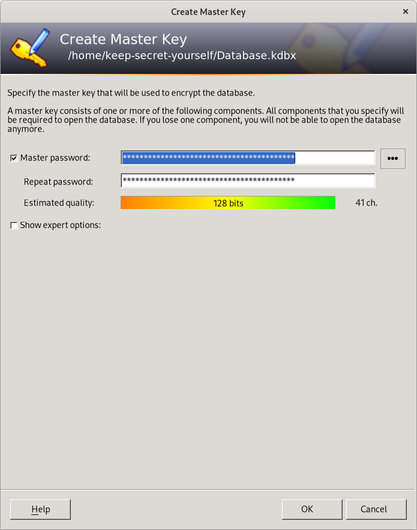
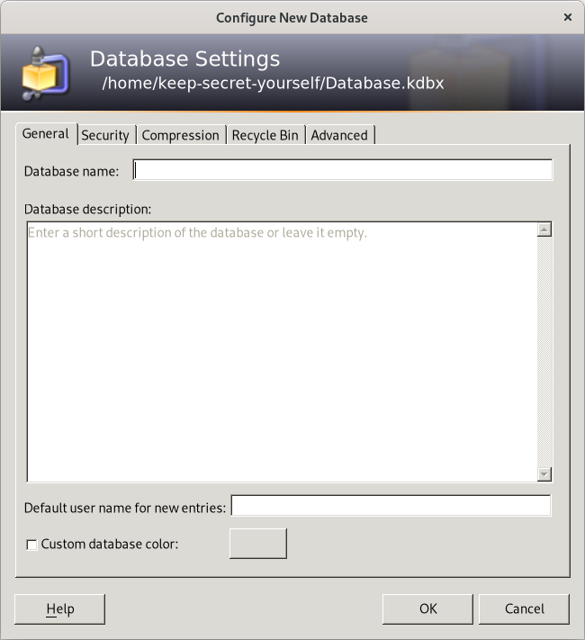
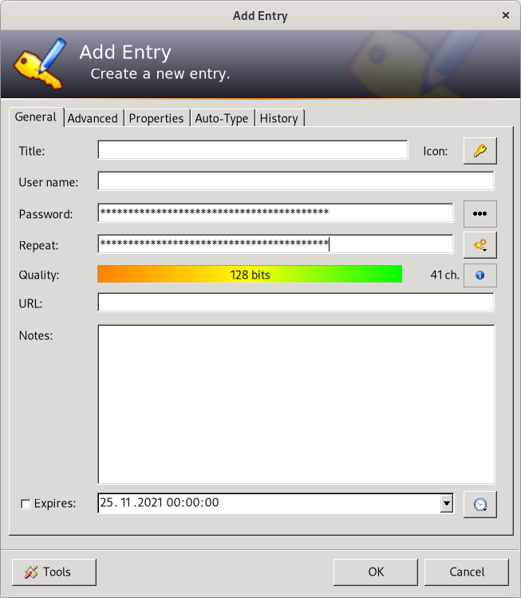
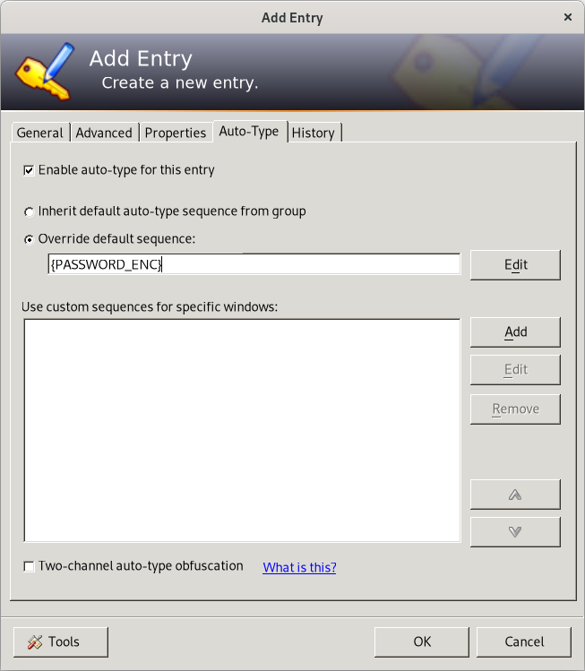

# keep-secret-yourself #
Tutorial to use Single Command Operations with KeePass Scripting Plugin (KPScript) with example shell-scripts 
## Requirements ##
* KeePass 2.x
* KPScript Plugin 2.x 
###  Optional
#### for sample_linux.sh usage:
* Linux: mono package for .NET(C#)
> Fedora:
>> sudo dnf install mono-devel 

#### for sample_windows.sh usage:
* Windows: Git-Bash Installation or other Linux Shell
> Windows 10:
>> You find github! :-) So you know what to do for it

## Quickstart ##
### 1. Install KeePass
### 2. Install KPScript Plugin
### 3. Open KeePass
### 4. Create 'new Database'
### 5. Create 'Master Key' 
>

### 6. Make Database Settings or keep it default 
> 
### 7. Make a 'new Entry' with the 'Master Key' as password
>
### 8. Choose 'Override default sequence' in Tab 'Auto-Type' and type {PASSWORD_ENC} and click OK
>
### 9. Save all
### 10. Open a Text-Editor
### 11. Switch back to KeePass, focus your Entry with the 'Master Key', rigth-click and perform a Auto-Type
### 12. Save the long encrypted Password in Editor
### 13. Copy the encrypted Password in sample.sh after flag -pw-enc:
### 14. Create a 'new Entry' with title,username and password
### 15. Before using sample_linux.sh or sample_windows.sh for your matching OS look at the comments in the example-script to set parameter 
